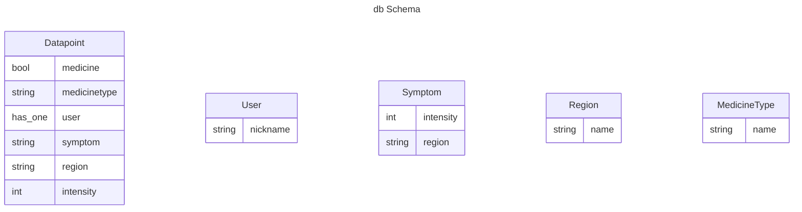

# allergy
An allergy symptoms tracker service in elixir with phoenix framework  

mix phx.gen.live Accounts User users name:string

mix phx.gen.live Allergy Datapoint datapoints user_id:references:users medicine:boolean medicinetype:string region:string symptom:string intensity:int 
    

